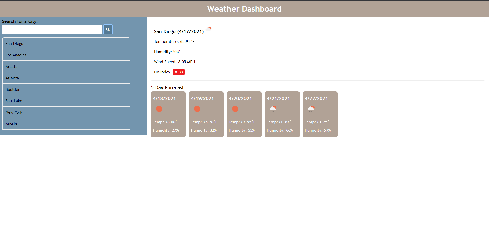
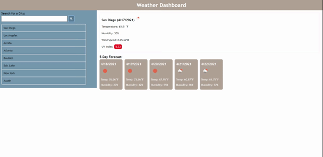

# HW-06-Weather-Dashboard
## Table of Contents
* [Description](#Description)
* [Technologies](#technologies)
* [Demonstration](#demonstration)
* [Instructions](#instructions)
* [Acknowledgements](#acknowledgements)
* [Questions](#questions)
## Description 
This is a weather dashboard application where the user inputs a city name and the current weather along with the 5-day forecast is displayed.  The application also locally stores the user inputs and can return results from previous city searches. 

## Technologies
* HTML
* CSS
* Javascript
* Font Awesome
* Jquery
* Moment.js
* Openweathermap.org API
## Demonstration

## Instructions
The user clicks in the search field and inputs the city that they wish to view the weather conditions.  If a valid city is typed in the input, the current weather and 5-day forecast are displayed on screen. The search inputs are locally stored and can be accessed again by clicking on the names on the side of the page. 
### About Us
N.A.
## Installation
N.A.
## Team Members
* Jake Williams
## Acknowledgements
* UCSD Coding Bootcamp instructional team and classmates
    * BCS Tutor "Arm" 
## Questions 
If you have any questions, please contact me on:
GitHub at [Jake](https://github.com/jakewill1107)
Email at [Jake](mailto:jbwilliams84@mail.com)

## Link to Deployed Website
https://jakewill1107.github.io/HW-06-Weather-Dashboard/